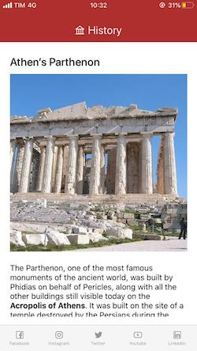
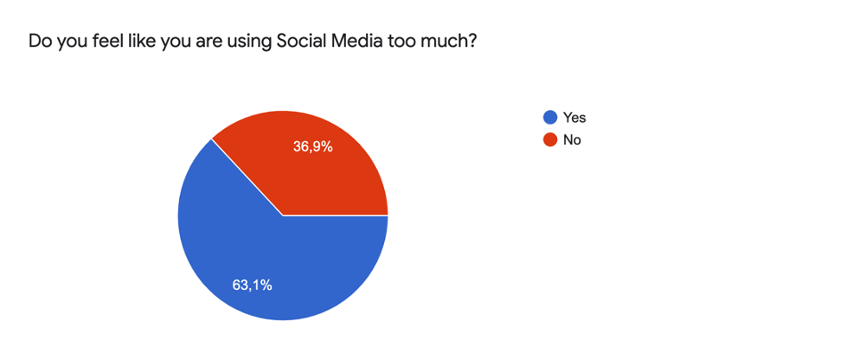
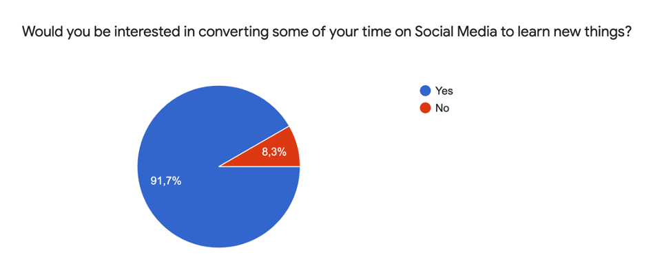
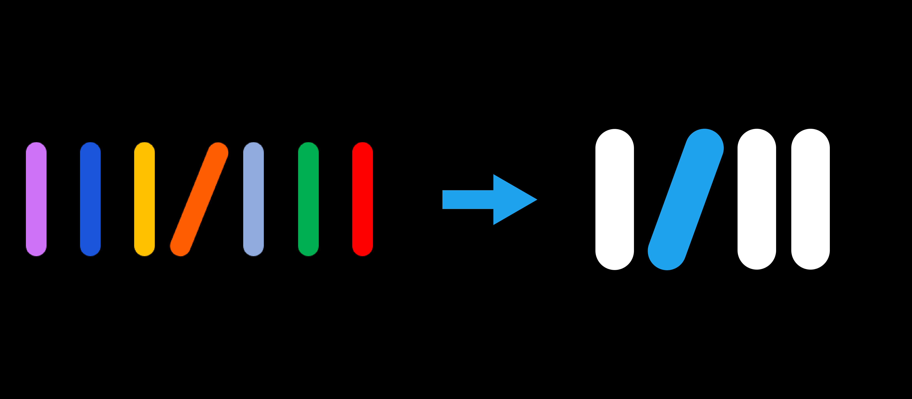

<h3 class="font-sans text-primary">0. Genesis</h3>

**“In the time you spend on social media each year, you could read 200 books”**.  
I can truly say that nothing has opened my eyes like this statement: it is the title of an [<u>article</u>](https://qz.com/895101/in-the-time-you-spend-on-social-media-each-year-you-could-read-200-books/) I read during a coffee break, back in February 2019.  

My name is [<u>**Alberto**</u>](https://www.linkedin.com/in/alberto-tanara-394a73150/), I am a management engineer and business consultant with an insane passion for history and music.  
I’ve always loved reading and learning new stuff since I was a kid, but only in that precise moment I realized how much things have changed over time.  
In ten years from now I’ll probably rewrite the previous sentence with: “I’ve always loved scrolling Social Media feeds, watching some unknown people’s stories and laughing at mindless (but still funny, I must admit) memes”. 

In fact, the article demonstrated in a very simple but clear way how the average time we spend on social media in a year would be enough to read 200 books. An astonishing figure, especially if we think about the problems related to misinformation and fake news that characterize our time: **how would the world be if everyone read 200 books a year?**  

Well, I started thinking something had to be done about it, but I needed help.  
[<u>**Tommaso**</u>](https://twitter.com/tommycarpi) is a Software Engineer with a strong passion for technology and all startup related stuff.  
We have been friends since high school and also ended up with working in the same firm at the time. I knew he was the right person to talk to about this.  

We started thinking about it and some ideas buzzed in our mind: the one that seemed to make more sense at the time was of an app providing a “learning bite” about a specific topic (e.g. science, history, art or literature) before accessing social media.  

Feeling the whole issue was not only interesting but could also have some kind of “social” positive effect, we decided to throw ourselves in this thing every time possible outside of our 9-to-21 job (That’s how Big4 Business Consulting works).  
This is basically how the whole thing kicked off: we had no idea how far we could have gone or what the whole thing would have turned out, but that was part of our lean startup strategy (that’s what we say now).  

<h3 class="font-sans text-primary">1. Gate - the social media killer app</h3>

We started from a first concept of product that consisted of a sort of “gate” (which eventually became the first product’s name) between users and social media. Basically, **an app through which the user could be redirected to their favorite social media app but only after the display of a brief “cultural” pill** (wouldn’t you read a short story about Athens’ Parthenon before your daily Instagram feed scroll?).  

These “pills” were thought to be short texts that the user could read in less than a minute.
I took charge of writing the texts to be displayed on the app, while Tommy worked on the technical part.  
We managed to write more or less 120 “learning bites” about history, science, art, literature, cinema and mysteries and by the end of November 2019 Gate was available on the App Store.  

  

<h3 class="font-sans text-primary">2. The pitfall</h3>

However, during those first months of restless work (imagine doing the research, the writing and developing the whole thing aside of an at-least-12-hours-long working day), given also a pinch of inexperience, **we turned a blind eye on a couple of things that would have ended up with disrupting our original idea.**  
We faced the biggest problem when we realized that this model was not scalable.  

Let me explain this: Gate showed 1 “pill” a day, not for technical reasons but because we couldn’t afford to “burn” our hand-written content at a faster pace.  
We had written slightly more than 100 articles in months of work, meaning that to keep up we should have had a team dedicated only to writing our “learning pills”. This meant that we had quite overestimated our “production” capacity.  

**Panic. Demotivation.**  

The most demotivating thing was that in that moment everything seemed so obvious: how couldn’t we think about these things earlier on? Before working so hard for months.  
I remember spending a two hours-long car drive on the phone with Tommy trying to put all the things together and avoiding more than a car crash (which happened to be the easier part in that moment).  
We still believed in our idea and we were truly convinced that we could work something good out of it. But we had to change a bit the rules of the game.  

<h3 class="font-sans text-primary">3. Time to Pivot</h3>

First of all, we had to **get rid of writing the content for the app**, because it meant for us too much focus on a non-strategic activity. After some reasoning, we realized that the solution was already out there. There’s plenty of magazines and blogs that write about science, history or technology. So, instead of writing our own content, we could have hosted those already on the market that better suited our concept of app.  
However, this brought a second issue in: how many news or magazines aggregators are there in the market? Flipboard, Feedly just to name the biggest ones.  
After a preliminary analysis of these possible competitors, we noticed that the biggest majority of them focuses mainly on news. We had clear in mind that **we should have not focused on news**, but rather on what we call now “cold-content”: something that is valid, interesting and readable today and tomorrow as well. 

<h3 class="font-sans text-primary">4. Lessons learned</h3>

Once defined the product concept and investigated possible sources to integrate in our app, before throwing again ourselves into the job recklessly, we decided **to validate our idea with a short survey**.  
The survey briefly presented the problem we wanted to solve and with a few questions we tried to figure out if the topics we wanted to provide were somehow interesting.  
We shared this survey in any way we could (friends, social media and blogs) and the outcome was quite encouraging: the greatest majority of the participants resulted quite enthusiast of our idea.  

 
  

<h3 class="font-sans text-primary">5. Birth of Rigel</h3>

While we were getting ready to begin the second and operative phase of the work Covid-19 came along, and we found ourselves stuck at home during Italy’s spring 2020 lockdown. The curious thing is that we had NEVER met to work together before (we used to meet only in the office during the coffee breaks that we managed to snatch from our work routine), so the lockdown didn’t disrupt much our work but gave us the opportunity to dedicate even more time to our project instead.  

During this time, **I selected about 200 sources** for articles and videos from the web to be included in the app, while **Tommy set up the whole app’s architecture and layout.**  
As the work proceeded, we still had to figure out a **name and a logo**: this took us several months since we wanted to find a name that truly reflected the app’s function and purpose.  
In the end, we decided to name the app after **Rigel**, one of the brightest stars of the sky (7th), belonging to the Orion constellation.  
We figured it as a sort of lighthouse for knowledge and culture, in the form of an app!  

The choice of the logo was more straightforward instead: while designing the app we had initially assigned a little colored bar to each category to be displayed in the app’s feed (e.g. blue for science, yellow for history). We put these seven little bars all together in a row, resembling books on a bookshelf. However, we realized that the logo was not meeting the eye enough compared to other apps’ logos. We kept only four thicker bars on a black background: three of them white while one in bright blue, referring to Rigel’s color. 

 

After months of work and little fine tunings, **we finally launched Rigel’s beta in August and officially released the final version of the app in November.**  
With the launch of the first beta, we opened also Rigel’s Social Media [<u>profiles</u>](https://www.instagram.com/rigelapp/) where we are currently sharing the learning bites we had previously written for Gate, in order to give users a hint of what they can find in Rigel. 

<h3 class="font-sans text-primary">6. What’s next?</h3> 

After few months from the launch, **we are currently working on some new cool features while starting to promote the app** in order to increase our user base.   

We are also **looking for colleagues**, excited as we are about Rigel’s mission, willing to join the team to boost our operations: throughout the last two years, two more people worked with us for a short period of time (which we want to personally thank for their contributions), eventually leaving the project for personal reasons.  

But most of all, we are working every day to improve our users’ experience.  
There’s a lot of work to be done and much more will come in the next months. 
If you got interested in our story, keep on following us.  

* [<u>rigelapp.com</u>](https://rigelapp.com/)
* [<u>twitter</u>](https://twitter.com/AppRigel)
* [<u>instagram</u>](https://www.instagram.com/rigelapp/)
* [<u>facebook</u>](https://www.facebook.com/rigelapp/)
 
Feel free to get in touch with us for anything you may want to know about Rigel and our story.

Until next time, thank you!  

Alberto

